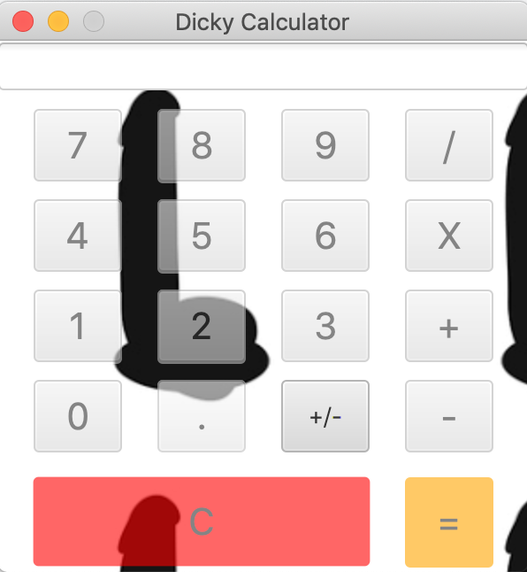

# Calculator-with-javaFx
This is a simply calculator made in JavaFx.

The purpose of this project was to learn the syntax of this language.
The +/- button still do not work but i am working on it :D 

